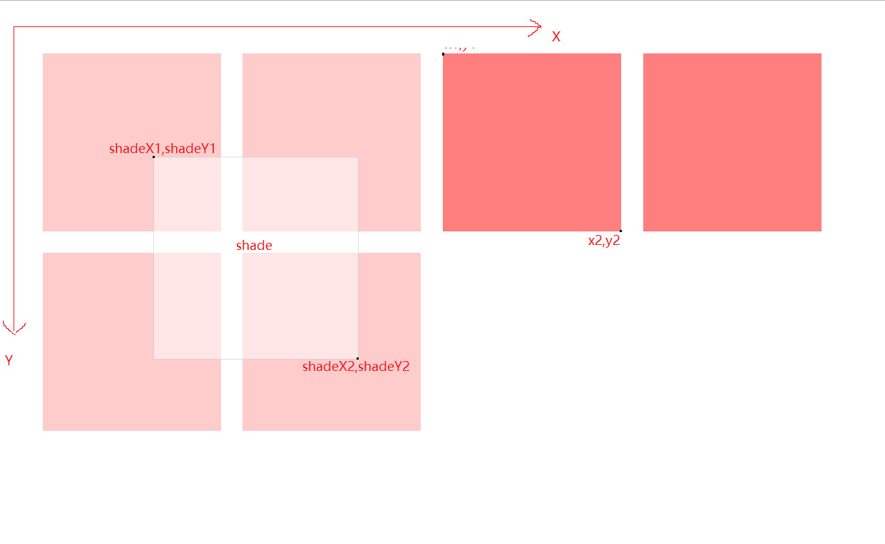
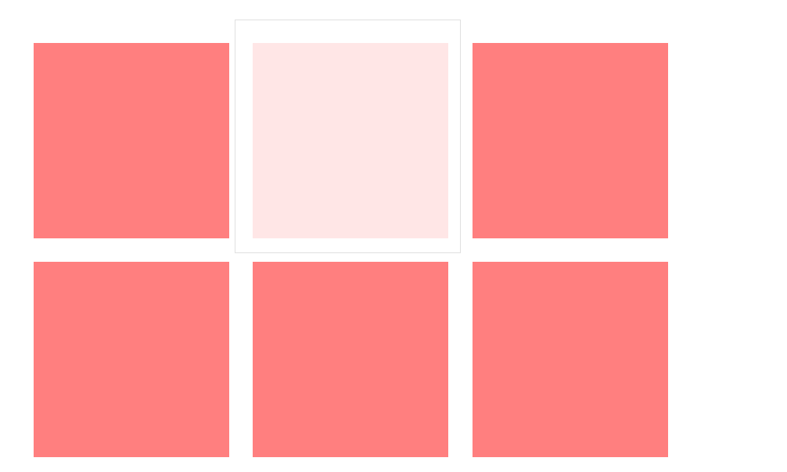
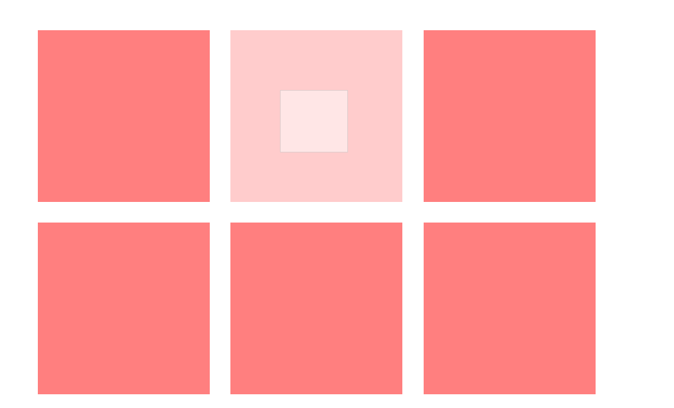
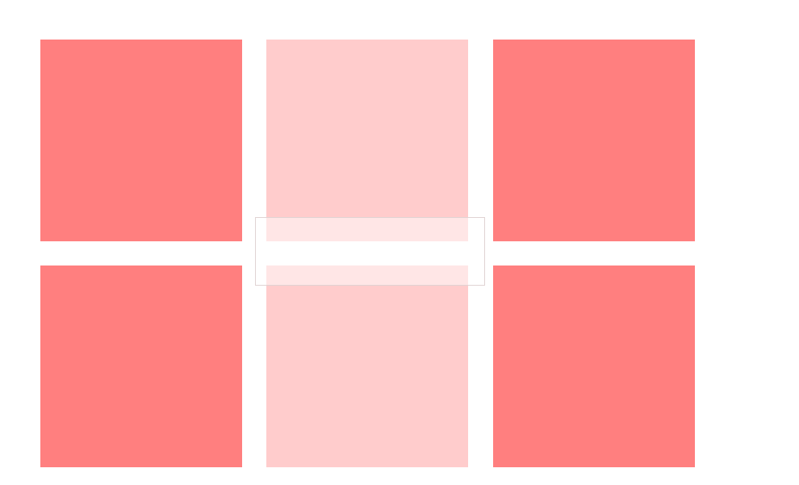

# 拖拽框选器
## DEMO
http://shihaiwei.top/html/dragSelect/index.html
## 使用方法
#### 引入index.js
```
<script src="./src/js/index.js"></script>
```
#### 建立容器和可选项
```
<div class="drag-select" id="dragSelect"> <!-- .drag-select 容器 -->
  <div class='ds-option style1' data-value="v1"></div>  <!-- .ds-option 可选项  data-value可选项的值  -->
</div>
```
#### 使用
```
  var DS = getDS()
  var dragSelect = document.getElementById('dragSelect')
  DS(dragSelect, {
    value: 'value', // 可选项值的key
    callBack(vList, eleList){
      valueList = vList || []
    }
  })
```

## 图示
1. 图1


1. 图2


1. 图3


1. 图4


1. 图5
